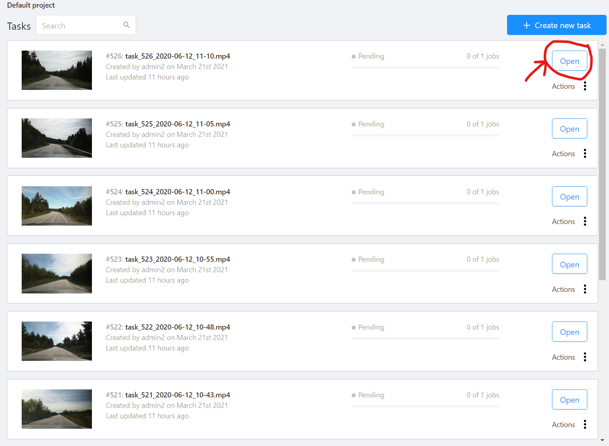
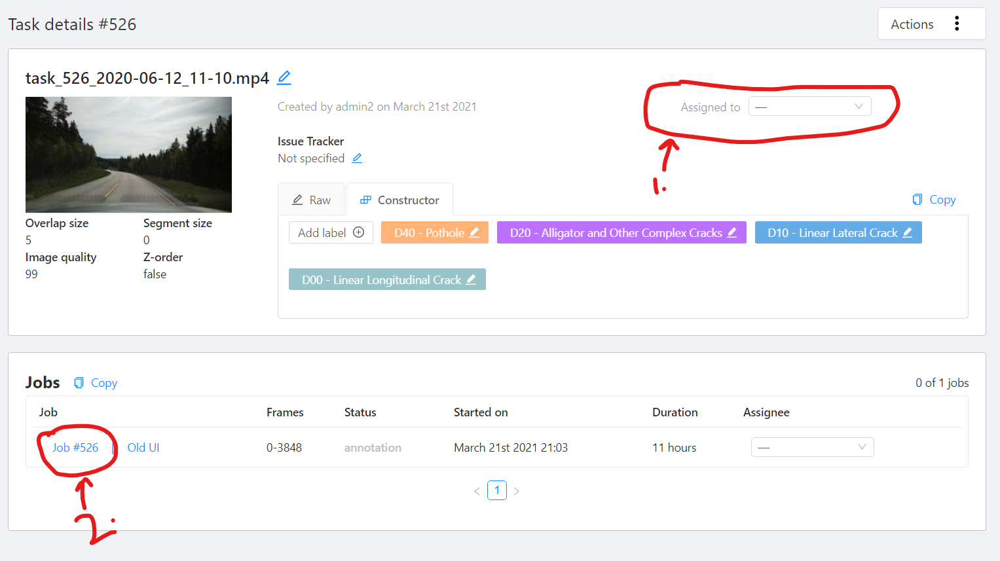
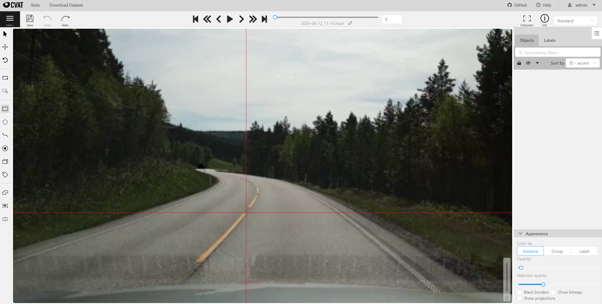
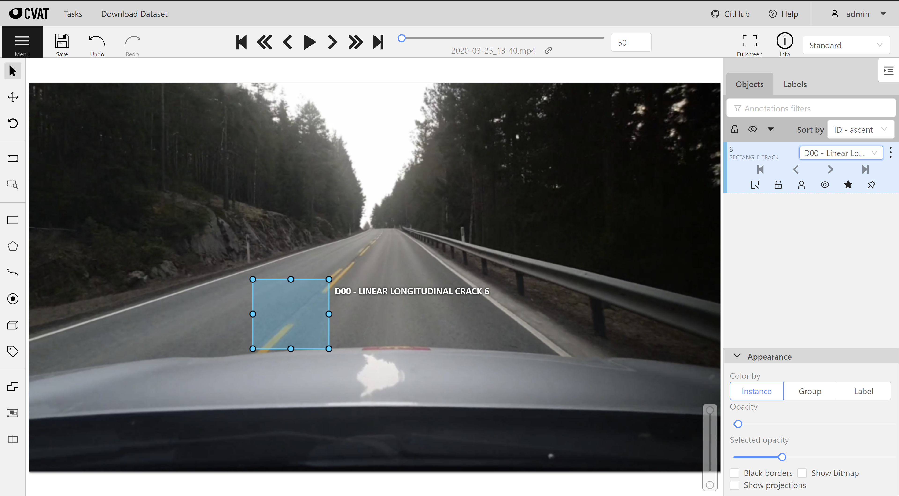
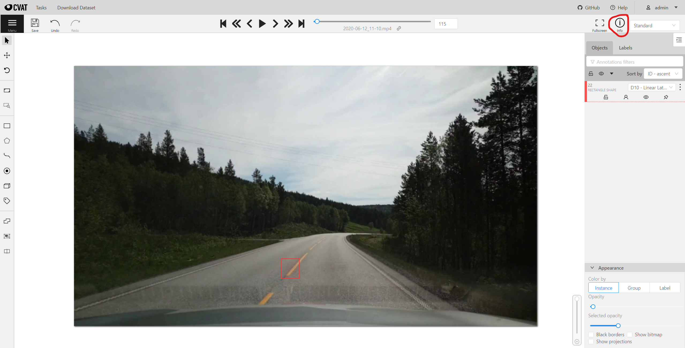
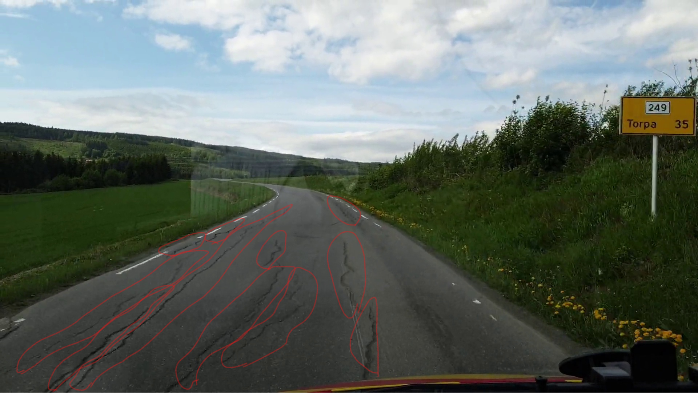
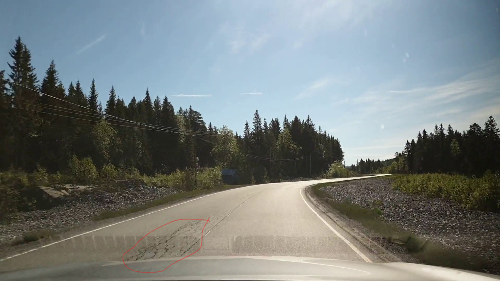

# Walkthrough of TDT4265 Annotation system

Make sure to read through this tutorial before looking at other resources.

## Other resources:
* Labeling specification. 
* OPENCV CVAT detailed user guide: [https://opencv.github.io/cvat/docs/manual/basics/interface/](https://opencv.github.io/cvat/docs/manual/basics/interface/)
* Interpolation mode tutorial: [https://www.youtube.com/watch?v=Hc3oudNuDsY&ab_channel=NikitaManovich](https://www.youtube.com/watch?v=Hc3oudNuDsY&ab_channel=NikitaManovich).

## Login
Open the link to the annotation web server, and log in with your provided username and password.

https://tdt4265-annotering.idi.ntnu.no/

## Open task
Open one of the available tasks visible in the task list by clicking the blue open button.

## Change assignee
From the highlighted drop-down menu, assign the task to your username. This will hide the task from other annotators. Then click the circled job text to start annotation.

**When you set yourself as the assignee, you're not able to remove yourself. Therefore, you have to finish the annotation task before starting a new one!**

## Used labels
These are the labels that you are supposed to be annotating: 

* D00 - Longitudnal Cracks
* D10 - Lateral Cracks
* D20 - Alligator/Complex Cracks
* D40 - Potholes

These are the same labels as from RDD2022 Dataset. All the labels are pre-entered. You just have to choose the label from the drop-down menu when creating a new bounding box.

Here are some annotation guidelines taken from VOC2011 Annotation Guidelines:

What to label:
ALL objects of the defined categories, unless:
* You are unsure what the object is.
* The object is very small (at your discretion). A general rule of thumb is that whatever a human eye can see, computer must be able to recognize. So if you can make out an object and which class it belongs to in the frame, you must label it.
* Do not label what you know but cannot see e.g. if a crack starts to appear in the frame but it is only a dot in the frame, do not label it. Label it only once it is recognisable.

Bounding box:
Mark the bounding box of the visible area of the object (not the estimated total extent of the object). Meaning for occluded objects, mark only the area you can see. Make the boundary as tight as possible.

Reflection:
If the reflection is transparent enough that the damage is clearly visible then mark it. If the reflection is occluding the damage too much then don't mark it.

## Annotation

Click on the point where you want to start the rectangle and then click on the opposite corner to create the box.

Make sure to select the correct class in the dropdown menu below the "create shape button", and try to experiment with the difference between interpolation and annotation drop down options. 

If you create annotation squares, try to experiment with the shortcut ctrl+b, which propogates the current bounding box a set amount of frames forwards in time. This can save time if the object in question does not move much relative to the frame. To delete a bounding box, click the bounding box in question and hit the delete button.

## Task complete
When you complete all frames in the task, click info on top right.

Mark the status as validation and assign yourself another task from the task list. You will be awarded points once the teaching assistants have verified your annotations.

Remember to save your work, either from the top left button, or hit ctrl+s.

You can go back to task list by clicking the Tasks option on top.

## Labeling Tips
* Mark all the disjoint cracks separately. If they are two close together such that the bounding boxes are overlapping or one box is inside the other box then mark them as one.

* Example of Alligator Cracks

